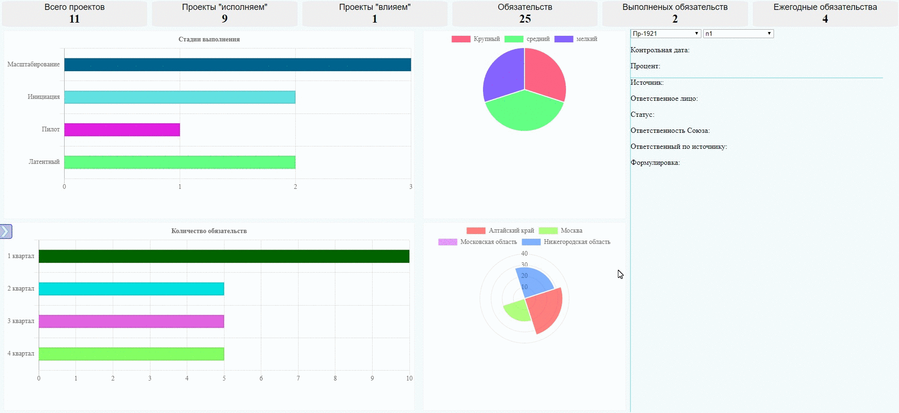
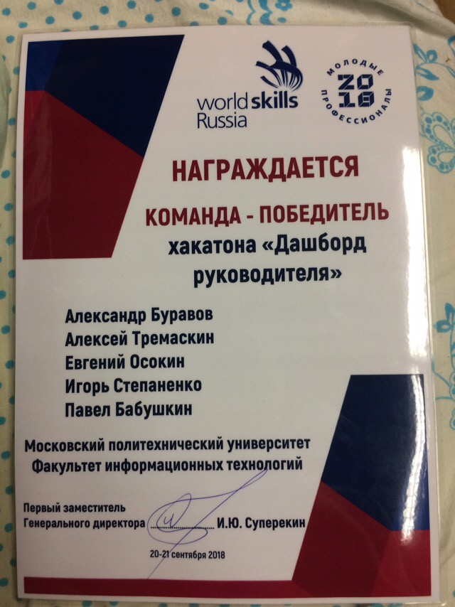

# WorldSkills Russia Dashboard

Хакатон проходил 20-21 сентября 2018 года в Московском Политехе от WorldSkills Russia.  
**Задача**: реализовать дашборд руководителя. Использовать полученные данные.  
**Условия**: 
- На главном экране всегда должны присутствовать главные показатели.
- Экран должен быть без прокрутки.
- Сделать фильтры проектов и правильно подобрать виды графиков для данных.
- Обеспечить защиту данных с помощью авторизации.



## Установка / Запуск

Требования: Node.js v8.11 или выше.

Для запуска сервера необходимо выполнить в папке проекта:
```bash
npm install
npm start
```
Сайт будет доступен по адресу http://localhost:4000

## Состав команды

<ul style="float: left;">
	<li>Александр Буравов - <i>фронтенд, бэкенд</i></li>
	<li>Алексей Тремаскин - <i>фронтенд</i></li>
	<li>Евгений Осокин - <i>фронтенд, анализ данных</i></li>
	<li>Игорь Степаненко - <i>дизайн, презентация</i></li>
	<li>Павел Бабушкин - <i>мобильное приложение</i></li>
</ul>

<p style="float: left;">Мобильное приложение отсутствует в данном репозитории.</p>